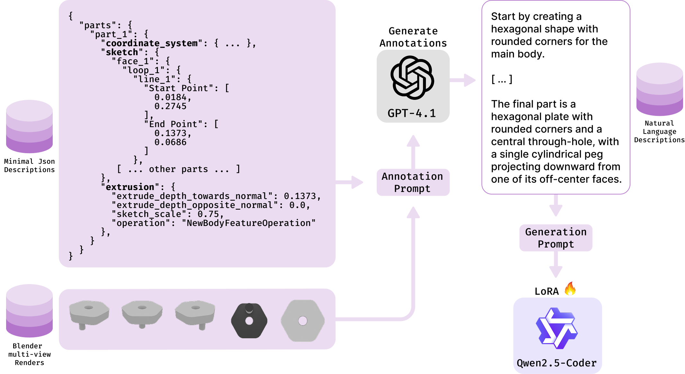

# CADmium: Fine-Tuning Code Language Models for Text-Driven Sequential CAD Design




This repository implements the paper "*CADmium: Fine-Tuning Code Language Models for Text-Driven Sequential CAD Design*".

## Quick Setup

Ensure Anaconda (or Miniconda) is installed. From the project root directory, run the following to create the environment and install dependencies:

```bash
conda deactivate
conda create --prefix=venv python=3.11 -y
conda activate venv 
# Note: If 'conda activate venv' doesn't target the local './venv' directory, 
# you might need to use 'conda activate ./venv' instead.
conda install -c conda-forge pythonocc-core -y
pip install -r requirements.txt
pip install -e .
```

This sequence sets up a local Conda environment in the `venv` subdirectory, activates it, and installs all required packages, including the project itself in editable mode.

## Tokenizing the Dataset
To process and tokenize the dataset:

1.  **Prerequisites:**
    * Successful environment setup (see above).
    * Raw dataset (e.g., `cadmium_ds`) located in `data/cadmium_ds`.

2.  **Run the tokenization script** from the project root directory:
    ```bash
    python cadmium/src/tokenize_dataset.py
    ```

3.  **Output:**
    The script saves tokenized data into three Parquet files (train, validation, test splits) in the `data/` folder (e.g., `data/train_json_qwen_tokenized.parquet`).

## Training the Model

To train the model with the default configuration:

```bash
torchrun --nproc_per_node=4 cadmium/src/train.py --config-name train
```

The training configuration is defined in `cadmium/config/train.yaml`. By default, this setup is optimized for **4 GPUs** using Fully Sharded Data Parallel (FSDP). 

### Adjusting for Fewer GPUs:
1. **Remove FSDP:** Comment out or remove the `fsdp_config` block in the YAML file
2. **Maintain Effective Batch Size:** The original configuration uses `per_device_batch_size=4` with 4 GPUs (total batch size=16). To replicate this on fewer devices:
   - Single GPU: Set `per_device_batch_size=16` *or* increase `gradient_accumulation_steps=4` (with `per_device_batch_size=4`)
   - Intermediate GPUs: Adjust proportionally (e.g., 2 GPUs → `per_device_batch_size=8` or `gradient_accumulation_steps=2`)

   Here's the enriched README with clear prediction instructions and device flexibility:

## Generating Predictions

To run inference with a trained model:

```bash
torchrun --nproc_per_node=N cadmium/src/predict.py --config-name predict
```

Where `N` is the number of GPUs to use. 

- It works with 1+ GPUs without code changes
- Predictions are saved in `data/results/` with:
  - Individual JSON files per sample when using `save_per_batch=True`
  - Consolidated CSV results after all batches complete
- Modify `cadmium/config/predict.yaml` to adjust:
  - Batch size (`eval.batch_size`)
  - Generation parameters (temperature, top-p, etc.)
  - Output directory paths


## Data Annotation

This process uses `GPT-4.1` via the OpenAI API to generate natural language descriptions for CAD modeling sequences. We utilize minimal JSONs representations and Blender renders from the [Text2CAD Hugging Face dataset](https://huggingface.co/datasets/SadilKhan/Text2CAD):  


First of all, you need to download and extract renders and minimal jsons:
```bash
# Create directory structure
mkdir -p data/text2cad_v1.1/{rgb_images,jsons}

# RGB Images
python -c "
from huggingface_hub import snapshot_download
snapshot_download(
    repo_id='SadilKhan/Text2CAD',
    allow_patterns='text2cad_v1.1/misc/rgb_images/*.zip',
    local_dir='data/text2cad_v1.1/rgb_images',
    repo_type='dataset'
)"
unzip data/text2cad_v1.1/rgb_images/text2cad_v1.1/misc/rgb_images/\*.zip -d data/text2cad_v1.1/rgb_images

# Minimal JSON Descriptions
python -c "
from huggingface_hub import hf_hub_download
hf_hub_download(
    repo_id='SadilKhan/Text2CAD',
    filename='text2cad_v1.1/misc/minimal_json/minimal_json_0000_0099.zip',
    local_dir='data/text2cad_v1.1/jsons',
    repo_type='dataset'
)"
unzip data/text2cad_v1.1/jsons/minimal_json_0000_0099.zip -d data/text2cad_v1.1/jsons

# Cleanup zip files
rm -rf data/text2cad_v1.1/{rgb_images,jsons}/text2cad_v1.1
```

Than, configure API access:
```bash
echo "OPENAI_API_KEY=your-key-here" > .env
```

And finally, run the annotation:
```bash
N_SPLITS=4  # Match to available CPU cores
for IDX in $(seq 0 $((N_SPLITS-1))); do
    python cadmium/src/annotate.py +n_splits=$N_SPLITS +idx_split=$IDX &
done
wait
```

## License

Licensed under the MIT License.
